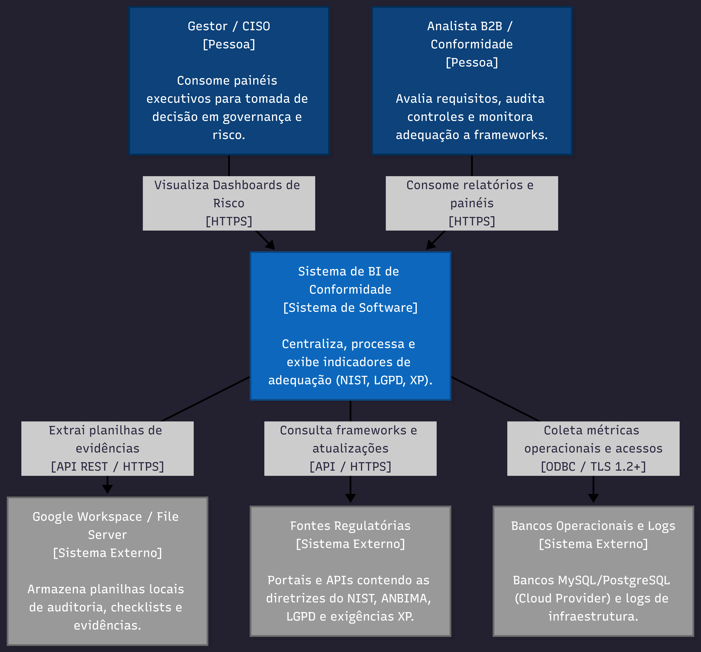
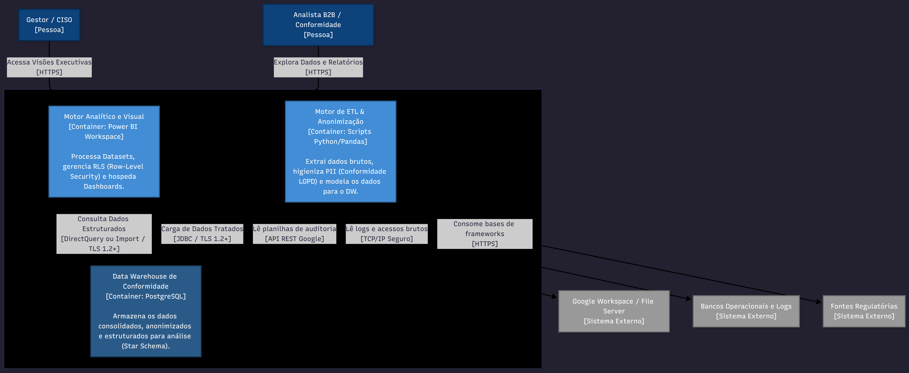
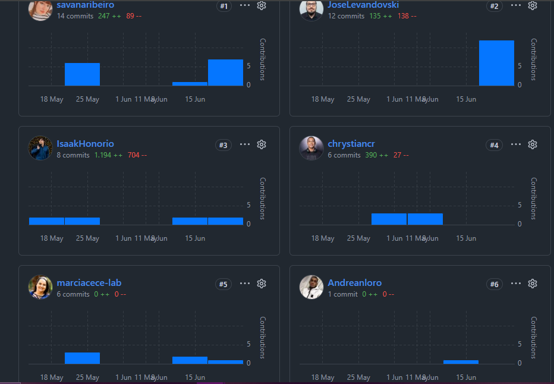

# RELATÓRIO TÉCNICO DE IMPLEMENTAÇÃO - GRUPO 23

**Curso:** Análise e Desenvolvimento de Sistemas  
**Disciplina:** Projeto Integrador  
**Professor(a):** Filipo Novo Mór  
**Título do Projeto:** Sistema de Business Intelligence para Gestão de Conformidade e Otimização de Atendimento a Requisitos de Cibersegurança (B2B)  

---
### INTEGRANTES E PAPÉIS EDITORIAIS
* **Andrean** – Desenvolvedor de BI (Business Intelligence) & Modelagem DAX
* **Chrys** – Engenheiro de Dados & Automação de Pipelines (ETL)
* **Isaak Honório** – Arquiteto de Segurança, Product Owner & Modelagem de Controles
* **José** – Tech Writer, Master do Repositório & Documentação Técnica
* **Márcia** – Analista de Compliance & Relacionamento Institucional B2B
* **Savana** – Analista de Governança, PMO & Auditoria de Evidências Síncronas

  ---
## 1. INTRODUÇÃO E ESCOPO DO PROJETO

Este relatório técnico consolida o desenvolvimento, a arquitetura e os mecanismos de governança aplicados no projeto integrador voltado ao Setor de Infraestrutura e Cibersegurança da empresa parceira **Clube do Valor**. 

O objetivo central do ecossistema foi mitigar a complexidade no atendimento a auditorias externas e questionários de *Due Diligence* de clientes corporativos (B2B). Para isso, estruturou-se uma solução analítica baseada em Business Intelligence (BI), capaz de centralizar matrizes de risco, avaliar níveis de maturidade em segurança da informação e transformar dados brutos em indicadores visuais claros, acionáveis e auditáveis.

---

## 2. GOVERNANÇA, ASPECTOS LEGAIS E LGPD

### 2.1. Termo de Autorização e Consentimento de Uso de Dados
Atendendo aos rigorosos critérios legais e éticos exigidos tanto pela instituição de ensino quanto pelas políticas de governança corporativa, formalizou-se o consentimento de uso de dados e imagem. A autorização foi assinada digitalmente por Leonardo Cardoso, responsável técnico na organização parceira. 

O respectivo documento digital (`Termo_assinado (1)_14.pdf`) e o termo de homologação técnica (`Termo_de_aceite-Projeto_Integrador.md - Clicksign_12.pdf`) encontram-se devidamente arquivados e custodiados eletronicamente junto à base de documentação oficial da equipe para fins de auditoria e validação acadêmica institucional.

### 2.2. Adequação da Base de Dados e Versionamento Concluídos com Sucesso
Para mitigar riscos de vazamento de informações corporativas reais, foi executado e homologado com total sucesso o processo de governança e adequação de dados na pasta `Dados_brutos`. Os questionários de avaliação de segurança originais (baseados em modelos da XP Investimentos) foram integralmente tratados, limpos e povoados com valores sintéticos (aleatórios) estruturados em formato `.csv` (registrados em arquivos como `matriz_conformidade_limpa_14.csv` e `matriz_importacao_pbi_14.csv`). 

A conclusão bem-sucedida desta etapa é evidenciada pelos seguintes marcos no repositório:
1. **Integridade Estrutural:** A base de dados anonimizada mantém o mesmo mapeamento de chaves e colunas necessárias para alimentar perfeitamente o script de ETL, sem quebras no pipeline de dados.
2. **Versionamento e Rastreabilidade:** O histórico de *commits* individuais do repositório atesta o versionamento limpo e a autoria das modificações, respeitando as boas práticas de Git e garantindo que nenhum dado confidencial real ficasse retido no histórico de revisões.
3. **Consistência de Ambiente:** A segregação de pastas entre `Dados_brutos`, `Images` e `Imagens_Registro` foi validada pelo grupo, permitindo a reprodução exata da solução por qualquer membro do time ou avaliador externo.

Os dados reais foram substituídos por dados sintéticos (aleatórios) estruturados em formato `.csv` na pasta `Dados_brutos`. Esse processo garantiu que as regras de negócio, cálculos de conformidade e estruturas relacionais permanecessem funcionais para o pipeline de dados, sem expor ativos de informação ou vulnerabilidades reais da empresa parceira.

---

## 3. METODOLOGIA DE GESTÃO E EVIDÊNCIAS SÍNCRONAS

A coordenação interna do projeto adotou premissas do framework ágil para garantir entregas incrementais organizadas. A divisão de papéis e responsabilidades foi distribuída de forma equilibrada entre engenharia de dados, modelagem, conformidade e documentação técnica.

Para assegurar a autoria, integridade e o rastreamento das contribuições, estabeleceu-se uma política rígida de controle de versão no GitHub baseada em *commits* individuais na branch principal. Os alinhamentos estratégicos com os *stakeholders* e as reuniões de progresso técnico (B2B) foram auditadas com capturas síncronas de tela contendo participantes, data e hora visíveis:

### Reunião de Alinhamento Inicial (12/04/2026)

### Segunda Reunião de Alinhamento (21/04/2026)

### Terceira Reunião de Alinhamento (27/05/2026)

---

## 4. ARQUITETURA DO SISTEMA (C4 MODEL)

A engenharia de software e a modelagem do fluxo de dados da solução analítica foram mapeadas utilizando a metodologia **C4 Model**. Essa abordagem permite segmentar a complexidade do sistema em múltiplos níveis de abstração:

### 4.1. Diagrama C4 Nível 1: Contexto
O primeiro nível delimita as fronteiras do sistema. Ele ilustra como os analistas de segurança e os auditores B2B interagem com a solução de inteligência de conformidade, bem como a relação externa com as matrizes de segurança fornecidas pela organização.

**Modelagem de Contexto do Sistema:** 

### 4.2. Diagrama C4 Nível 2: Contêiner
O nível de contêiner detalha a arquitetura tecnológica e a engenharia de dados aplicada. O fluxo compreende a extração dos arquivos `.csv` anonimizados, o processamento e tratamento lógico dos dados por meio de scripts automatizados em Python (ETL) e, finalmente, a carga e modelagem relacional dos dados para consumo analítico.

**Modelagem de Contêineres e Componentes:** 

---

## 5. RESULTADOS ALCANÇADOS E ENTREGA TÉCNICA

A conclusão do projeto resultou em um ambiente analítico robusto e integrado que atende plenamente aos objetivos propostos:

1. **Pipeline de Automação (ETL):** O script de Extração, Transformação e Carga desenvolvido em Python garantiu que o tratamento de dados brutos ocorresse sem intervenção manual, padronizando colunas essenciais como *Camada*, *Solução*, *Fabricante* e *Status de Implantação*.
2. **Modelo de Dados Relacional:** A base de dados estruturada no repositório permitiu cruzar os controles de cibersegurança com os frameworks exigidos pelo mercado, facilitando auditorias retroativas.
3. **Painel de Business Intelligence (Power BI):** O dashboard final consolidou métricas críticas, taxas percentuais de aderência a frameworks de segurança e lacunas (*gaps*) de conformidade em tempo real. Isso transformou tabelas densas em relatórios visuais dinâmicos para a tomada de decisão da diretoria, explicitando analiticamente o cenário atual da organização parceira com 117 controles mapeados e um score global de conformidade de 46,15%, o que enquadra institucionalmente o nível de maturidade em Risco Alto de acordo com os parâmetros de corte da Matriz da XP Inc.

---

## 6. GOVERNANÇA, RASTREABILIDADE E EVIDÊNCIAS FINAIS (GITHUB)

A governança deste projeto seguiu os critérios pedagógicos de transparência, equidade e rastreabilidade definidos para a Universidade LaSalle. A execução das atividades e a construção dos artefatos técnicos foram distribuídas entre os 6 integrantes do grupo, com auditoria realizada diretamente pelo histórico de commits individuais no repositório institucional do GitHub (`IsaakHonorio/projeto_integrador_ADS.git`).

Como evidência de encerramento da Etapa Final, consolidação da entrega e validação dos dados tratados, o grupo realizou uma sessão síncrona técnica de fechamento, documentada a seguir:

| Atividade | Data | Descrição e Evidência da Atividade | Status |
| :--- | :--- | :--- | :--- |
| **Encerramento da Etapa Final e Upload do Repositório** | 22/06/2026 | Consolidação da entrega técnica. Toda a documentação de arquitetura, scripts Python de ETL e arquivos de modelagem foram validados e enviados ao repositório institucional, registrando a rastreabilidade e participação dos 6 integrantes.  **Evidência local da reunião síncrona:**  | Atividade concluída. |

*Nota de Conformidade: Em estrita observância aos guardrails acadêmicos, a imagem embutida localmente atesta o registro síncrono da reunião de encerramento da equipe através da interface ativa do sistema operacional, exibindo de forma visível e explícita os nomes dos participantes, a data (22/06/2026) e o horário de realização.*

### 6.1. Auditoria e Rastreabilidade de Contribuições Individuais (GitHub)

Para mitigar qualquer ambiguidade de autoria e validar a diretriz pedagógica de participação equitativa e colaborativa, o histórico de interações com o repositório institucional foi auditado de forma centralizada através do painel de telemetria da própria plataforma de versionamento. A governança estabelecida pelo time exigiu que cada acadêmico atuasse como responsável técnico direto pela submissão de seus respectivos componentes lógicos e documentais.

Como evidência unificada de auditoria assíncrona, a captura de tela abaixo ilustra o painel consolidado de contribuidores do projeto, registrando de forma imutável o rastro digital, os perfis validados e o volume total de commits de cada conta homologada:

---

## 7. CONSIDERAÇÕES FINAIS

O Projeto Integrador do Grupo 23 demonstra com sucesso a viabilidade de aplicar conceitos de Engenharia de Dados e Business Intelligence para resolver dores reais de governança e cibersegurança corporativa no cenário B2B. 

A arquitetura desenvolvida não apenas cumpre as diretrizes da LGPD por meio de técnicas eficazes de anonimização e tratamento de dados sintéticos, mas também entrega valor prático ao setor de Infraestrutura e Operações do Clube do Valor ao reduzir drasticamente o tempo de resposta a auditorias externas e questionários de *Due Diligence* de parceiros como a XP Inc. 

A experiência prática consolidou competências fundamentais em desenvolvimento ágil, arquitetura de sistemas utilizando o C4 Model, automação de pipelines de dados e conformidade regulatória, qualificando de forma robusta e integrada o perfil profissional dos acadêmicos integrantes do time.
